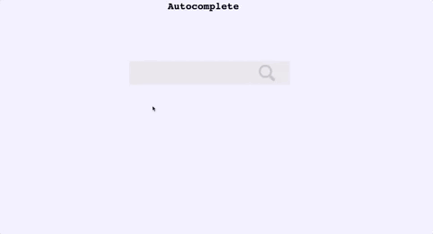

autocomplete
---



Prefix-tree based autocompletion.


### Design

```

    -----           -----
   | web |  -----  | App |
    -----           -----
    
Web: A React frontend
App: A Python Flask app, serves the prefix tree.    

```

A pre-order serialization/deserialization for disk persistence has 
been [implemented](https://github.com/redwrasse/autocomplete/blob/b758c5fe71efbb29fc9ad14bad7bcf2b76cfd549/app/trie.py#L69-L106) as well. The serialization adds the number of children for the given 
node prior to adding the given node to enable deserialization. This means, of course, 
that any text added to the prefix tree must be alphabetic only.

Example serialization string: `'2*1f2o1o1$1z1$1b1a1r1$'`
 

### Run

``` docker-compose up --build```


### To Do
* shard prefix tree
* support adding and selecting documents for search


