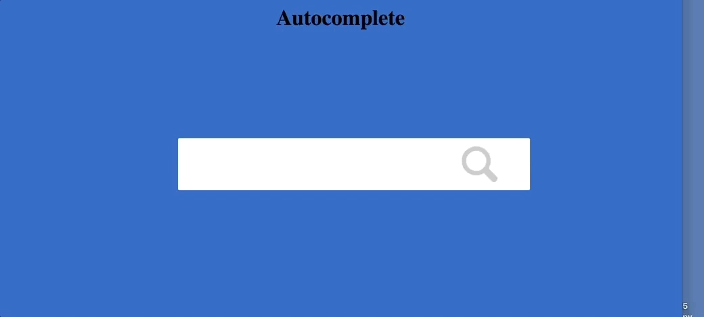

autocomplete
---



Versions

* Autocomplete1: Open file and scan (first seek to beginning) to match line containing input, for each new input.
* Autocomplete2: Open file and store in memory as list, iterate over list to match input, for each new input.
* Autocomplete3: Same as version 2 but refine down list for each incremental input. First stateful autocomplete. Kind of an unsorted prefix tree.
* Autocomplete3: Prefix tree-based autocomplete (tbd).
* Autocomplete4: Machine-learning based autocomplete. Based off an LSTM next-character model.


### Run

``` docker-compose up --build```


